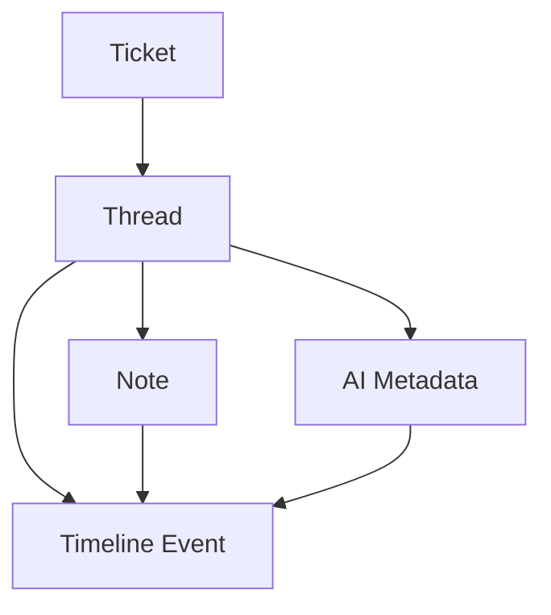

# Thread System Data Flow

## Data Model Relationships



## Core Relationships

### 1. Ticket -> Thread
- One ticket can have multiple threads
- Each thread belongs to one ticket
- Threads track conversation context
```typescript
interface Thread {
    id: string
    ticket_id: string
    created_at: string
    updated_at: string
    title?: string
    status: 'open' | 'closed'
    thread_type: 'customer_initiated' | 'agent_initiated' | 'ai_initiated'
    ai_context: {
        context_type: 'question' | 'issue' | 'feedback'
        sentiment?: 'positive' | 'neutral' | 'negative'
        priority_indicator?: number
        topic_tags?: string[]
    }
}
```

### 2. Thread -> Note
- One thread contains multiple notes
- Each note belongs to one thread
- Notes represent individual messages in chronological order
```typescript
interface ThreadNote {
    id: string
    thread_id: string
    content: string
    created_at: string
    created_by: string
    message_type: 'customer' | 'agent' | 'system' | 'ai'
    metadata?: {
        ai_processed: boolean
        sentiment?: string
        key_points?: string[]
    }
}
```

### 3. Thread -> AI Metadata
- Each thread has associated AI metadata
- Metadata evolves as conversation progresses
```typescript
interface ThreadAIMetadata {
    context_history: Array<{
        timestamp: string
        context_update: string
        confidence: number
    }>
    suggested_responses?: Array<{
        content: string
        confidence: number
        context: string
    }>
    auto_tags: string[]
    sentiment_analysis: {
        overall: string
        trend: 'improving' | 'stable' | 'deteriorating'
    }
}
```

### 4. Integration with Timeline
- Threads and notes appear in timeline
- AI interactions visible in timeline
- Timeline events reference thread context
```typescript
interface EnhancedTimelineEvent extends TicketTimelineEvent {
    thread_id?: string
    thread_context?: {
        title: string
        message_count: number
        last_update: string
        ai_summary?: string
    }
}
```

## Data Flow Patterns

1. **Thread Creation Flow**
   - Customer or agent initiates thread
   - System creates thread record
   - Initial message creates first note
   - AI processes thread context
   - Timeline updated with new thread

2. **Message Flow**
   - New message added to thread (chronologically ordered)
   - AI processes message content
   - Thread metadata updated
   - Timeline reflects new activity
   - Real-time updates pushed to UI

3. **AI Integration Flow**
   - AI monitors thread activity
   - Processes new messages
   - Updates thread metadata
   - Suggests responses
   - Updates timeline with AI insights

## Performance Considerations

1. **Indexing Strategy**
   - Thread ID for quick lookups
   - Ticket ID for relationship queries
   - Created_at for timeline ordering
   - Full-text search on content

2. **Real-time Updates**
   - Subscribe to thread changes
   - Batch AI processing updates
   - Optimize timeline queries

3. **Caching Strategy**
   - Cache thread metadata
   - Cache recent messages
   - Cache AI suggestions 